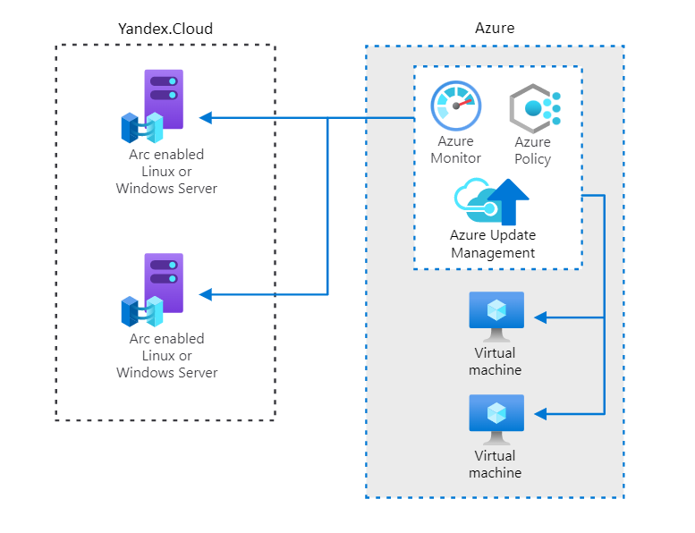
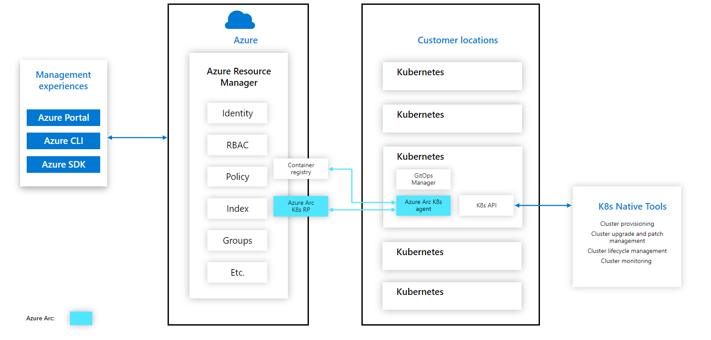
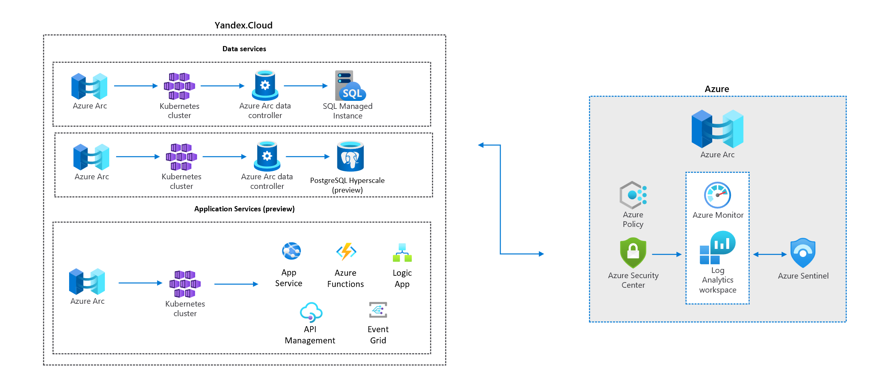

# Yandex.Cloud Solution Library for Azure

This repository contains a number of building blocks that will help developers and DevOps engineers build hybrid solutions between Yandex and Azure clouds. We tried to identify the most common tasks that developers encounter while architecting or developing solutions, described the best practices, and provided examples of automation.

We are always open to new ideas for adding blocks to the repository. If you think we missed something, please contact us and describe your scenario in the GitHub repository under Issues.

## Why we did it

Organizations often have tens, hundreds and more applications in their IT environments. These applications run in a diverse infrastructure with data centers, hosting environments and branch offices and may also run in multi-cloud scenarios. Regulations in many countries require keeping certain data within the physical borders of those particular countries. Adding to this complexity, customers also use different development tools, languages and frameworks as well as technologies like DevOps, Kubernetes and AI. Organizations need a solution to architect, design, and manage hybrid applications and infrastructure where components are distributed across public cloud services, private clouds, data-centers and edge locations without sacrificing central visibility and control.

To address these scenarios, we decided to implement best practices and automation techniques to help bootstrap development and deployment. Below you’ll find some common architecture patterns that can be developed using the integration block examples in this repository, among other things.

Many architectures that you will see below are built upon a powerful and comprehensive set of tools - [Azure Arc](https://docs.microsoft.com/en-us/azure/azure-arc/overview), which unlocks new hybrid scenarios for customers by extending Azure services and management to any infrastructure. Azure Arc offers simplified management, faster app development, and consistent Azure services. By pushing Azure Arc onto on-premises, multi-cloud or edge systems customers can bring cloud native patterns to a diverse array of virtual and physical devices.

## Use cases and solution architecture

### Manage and govern multi-cloud environments with a single control plane
This is an example of organization with several servers deployed in multiple locations. It is also using DevOps practices which result in an unknown number of servers that are connected to the corporate networks but do not conform to identity and governance requirements. This organization needs to gain some control of their environment and ensure the compliance requirements are met for audit purposes.

[Azure Arc-enabled servers](https://docs.microsoft.com/en-us/azure/azure-arc/servers/overview) enables you to manage your Windows and Linux physical servers and virtual machines hosted outside of Azure, on your corporate network, or other cloud provider. This management experience is designed to be consistent with how you manage native Azure virtual machines. When a hybrid machine is connected to Azure, it becomes a connected machine and is treated as a resource in Azure, so you can benefit from standard Azure constructs, such as Azure Policy and applying tags. 

Examples to help build this architecture:
* [Azure Arc-enabled Yandex.Cloud virtual machines]()
* [Azure Arc-enabled SQL server](https://github.com/yandex-cloud/yc-solution-library-for-azure/tree/main/Yandex-Azure%20Arc%20SQL)
* [Setting up federation in Yandex.Cloud through Azure AD](https://github.com/yandex-cloud/yc-solution-library-for-azure/tree/main/Yandex-Azure%20AD%20Federation)
* [Setting up a VPN between Azure VNET and Yandex VPC](https://github.com/yandex-cloud/yc-solution-library-for-azure/tree/main/Yandex-Azure%20VPN)

### At-scale multi-cloud Kubernetes app management
Here is an organization which have several branches and have in-office applications. They’d like to move all these applications to containers running on Kubernetes clusters but they are not sure how they can uniformly deploy and configure these applications across multiple locations. They need to be able to onboard a new location that can run with the specific applications that this office needs, apply governance, monitor these clusters as well as integrate DevOps practices.

This is where Azure Arc-enabled Kubernetes comes into play. You can project the Kubernetes clusters to Azure, so you can organize and view all your clusters in Azure (similar to Azure Arc-enabled servers) but you can also configure them uniformly, called zero touch configuration. This practice is called GitOps, which is a Kubernetes operating model. In GitOps, the configurations are declared and stored in a Git repo and our Arc agents running on the cluster continuously monitor this repo for updates or changes and automatically pulls down these changes to the cluster.

Examples to help build this architecture:
* [Azure Arc-enabled Yandex.Cloud Managed Kubernetes Cluster](https://github.com/yandex-cloud/yc-solution-library-for-azure/tree/main/Yandex-Azure%20Arc%20Kubernetes)
* [Setting up federation in Yandex.Cloud through Azure AD](https://github.com/yandex-cloud/yc-solution-library-for-azure/tree/main/Yandex-Azure%20AD%20Federation)
* [Setting up a VPN between Azure VNET and Yandex VPC](https://github.com/yandex-cloud/yc-solution-library-for-azure/tree/main/Yandex-Azure%20VPN)

### Run data and application services anywhere
One company wants to build new applications or modernize existing applications and infrastructure so they can capture and analyze data at remote locations worldwide and deliver onsite, real-time insights with no latency.

Azure Arc makes it possible to run [Azure data services](https://docs.microsoft.com/en-us/azure/azure-arc/data/overview) on any Kubernetes environment as if it runs in Azure (specifically Azure SQL Managed Instance and Azure Database for PostgreSQL Hyperscale, with benefits such as upgrades, updates, security, and monitoring). Use elastic scale and apply updates without any application downtime, even without continuous connection to Azure.
 
You can also run [App Service, Functions, and Logic Apps](https://docs.microsoft.com/en-us/azure/app-service/overview-arc-integration) on an Azure Arc-enabled Kubernetes cluster that can be on-premises or hosted in a different cloud. This approach lets app developers take advantage of the features of App Service. At the same time, it lets their IT administrators maintain corporate compliance and safeguard their prior investments in other cloud providers or hardware by running App Service on existing Kubernetes clusters.

Examples to help build this architecture:
* [Azure Arc-enabled data services]()
* [Azure Arc-enabled app services - preview]()
* [Setting up federation in Yandex.Cloud through Azure AD](https://github.com/yandex-cloud/yc-solution-library-for-azure/tree/main/Yandex-Azure%20AD%20Federation)
* [Setting up a VPN between Azure VNET and Yandex VPC](https://github.com/yandex-cloud/yc-solution-library-for-azure/tree/main/Yandex-Azure%20VPN)

### Build Multi-Cloud Storage solutions

Complex nature of geographically diverse customer base, government regulations and competition require companies to search for ways to seamlessly consume services from multiple cloud providers in a single multi-cloud infrastructure. Flexify.IO allow unifying object storage across Azure Blob Storage and Yandex Cloud Object Storage into a single virtual S3-compatible storage system.

Examples to help build this architecture:
* [Multi-Cloud Storage with Microsoft Azure and Yandex Cloud](https://github.com/yandex-cloud/yc-solution-library-for-azure/tree/main/Yandex-Azure%20Flexify.io%20Multi%20Cloud%20Storage)
* [Setting up federation in Yandex.Cloud through Azure AD](https://github.com/yandex-cloud/yc-solution-library-for-azure/tree/main/Yandex-Azure%20AD%20Federation)
* [Setting up a VPN between Azure VNET and Yandex VPC](https://github.com/yandex-cloud/yc-solution-library-for-azure/tree/main/Yandex-Azure%20VPN)

## Technical implementation of common scenarios

Following are links on all technical scenarios mentioned above in the use cases:
#### 1. [Setting up federation in Yandex.Cloud through Azure AD](https://github.com/yandex-cloud/yc-solution-library-for-azure/tree/main/Yandex-Azure%20AD%20Federation)
#### 2. [Setting up a VPN between Azure VNET and Yandex VPC](https://github.com/yandex-cloud/yc-solution-library-for-azure/tree/main/Yandex-Azure%20VPN)
#### 3. [Multi-Cloud Storage with Microsoft Azure and Yandex Cloud](https://github.com/yandex-cloud/yc-solution-library-for-azure/tree/main/Yandex-Azure%20Flexify.io%20Multi%20Cloud%20Storage)
#### 4. [Yandex - Azure Interconnect](https://github.com/yandex-cloud/yc-solution-library-for-azure/tree/main/Yandex-Azure%20Interconnect)
#### 5. [Azure Arc-enabled Yandex.Cloud virtual machines]()
Azure Arc-enabled servers enables you to manage your Windows and Linux physical servers and virtual machines hosted outside of Azure, on your corporate network, or other cloud provider. This management experience is designed to be consistent with how you manage native Azure virtual machines.
#### 6. [Azure Arc-enabled SQL server](https://github.com/yandex-cloud/yc-solution-library-for-azure/tree/main/Yandex-Azure%20Arc%20SQL)
You can enable SQL Server on Azure Arc-enabled servers. It extends Azure services to SQL Server instances hosted outside of Azure; in your datacenter, on the edge, or in a multi-cloud environment.
#### 7. [Azure Arc-enabled Yandex.Cloud Managed Kubernetes Cluster](https://github.com/yandex-cloud/yc-solution-library-for-azure/tree/main/Yandex-Azure%20Arc%20Kubernetes)
Azure Arc enabled Kubernetes manages cluster configuration and application deployment on any Kubernetes cluster. It adopts a GitOps methodology, so customers define their applications and cluster configurations in source control, in this case, Git. Azure Arc-enabled Kubernetes works with any Cloud Native Computing Foundation (CNCF) certified Kubernetes clusters.
#### 8. [Azure Arc-enabled data services]()
Azure Arc makes it possible to run Azure data services on-premises, at the edge, and in public clouds using Kubernetes and the infrastructure of your choice.
Currently, the following Azure Arc-enabled data services are available: SQL Managed Instance and PostgreSQL Hyperscale (preview).
#### 9. [Azure Arc-enabled app services - preview]()
You can run App Service, Functions, and Logic Apps on an Azure Arc-enabled Kubernetes cluster. The Kubernetes cluster can be on-premises or hosted in a third-party cloud. This approach lets app developers take advantage of the features of App Service. At the same time, it lets their IT administrators maintain corporate compliance by hosting the App Service apps on internal infrastructure.

## Additional information

You can use these links to go through official documentation about Azure Arc:
* https://azure.microsoft.com/en-us/solutions/hybrid-cloud-app/
* https://docs.microsoft.com/en-us/azure/azure-arc/
* https://docs.microsoft.com/en-us/learn/modules/intro-to-azure-arc/
* https://azurearcjumpstart.io/overview/
