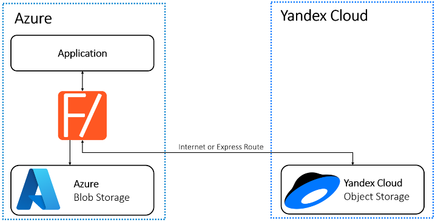
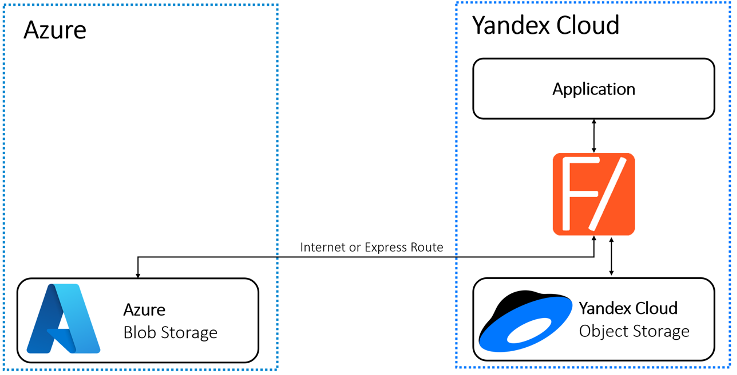
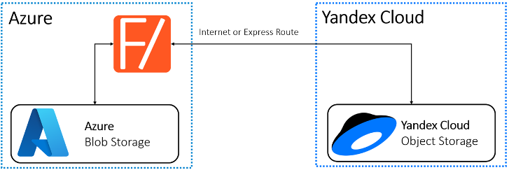
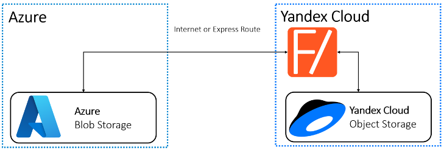
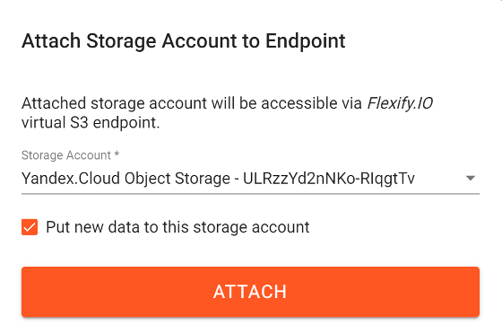
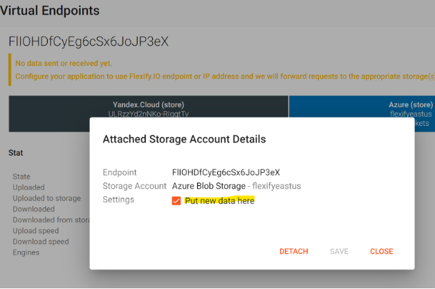
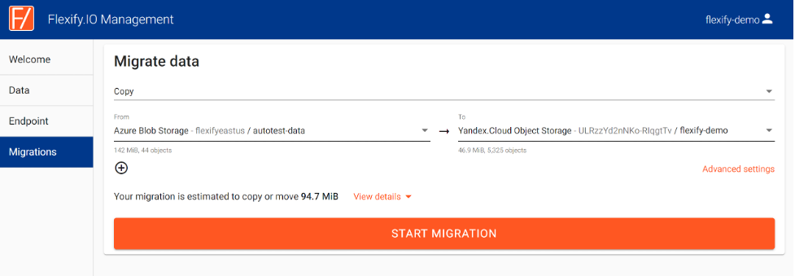

# Multi-Cloud Storage with Microsoft Azure and Yandex Cloud

Complex nature of geographically diverse customer base, government regulations and competition require companies to search for ways to seamlessly consume services from multiple cloud providers in a single multi-cloud infrastructure. 
Flexify.IO allow unifying object storage across Azure Blob Storage and Yandex Cloud Object Storage into a single virtual S3-compatible storage system. This can be helpful if you’d like:

1.	Synchronously replicate data between Azure Blob Storage and Yandex Cloud Storage.
2.	Offload some of the data from Azure Blob Storage to Yandex Cloud Object Storage or vice versa.
3.	Combine data from Azure Blob Storage and Yandex Cloud Object Storage into a single namespace.
4.	Work with data in Azure Blob Storage via standard S3-compatible API.
5.	Migrate data between Azure Blob Storage and Yandex Cloud Object Storage. 

## Architecture Overview

Flexify.IO acts as a proxy between your S3-compatible applications and object storage offers from multiple cloud vendors. 

You can use Flexify.IO to transparently distribute data between [Yandex.Cloud Object Storage](https://cloud.yandex.com/services/storage) and [Azure Blob Storage](https://azure.microsoft.com/en-us/services/storage/blobs/). 

Flexify IO listen for S3 requests from your applications and proxies them to multiple attached storages, converting API on the fly if needed. We generally recommend placing Flexify closet to applications to minimize latency. 

## Scenarios
### Application in Azure works with data in Azure Blob Storage and Yandex Cloud Object Storage. 

Deploying Flexify IO from Azure Marketplace (same region as the application) and configure application to use Flexify’s virtual S3-compatible endpoint. Even though Azure Blob Storage does not provide S3-comaptible API natively, Flexify IO will convert requests and responses on-the fly. The application will see data combined from Azure Blob Storage and Yandex Cloud Storage. 

### Application is Yandex Cloud works with data in Azure Blob Storage and Yandex Cloud Object Storage.
Deploy Flexify from Yandex Cloud Marketplace and configure it like in the previous case. 

### Applications elsewhere works with data from Azure Blob Storage and Yandex Cloud Object Storage. 
Deploy Flexify IO closer to your applications or end users. If not possible, deploy Flexify IO to the cloud where you want to store most frequently accessed data. Flexify IO will automatically choose the closets and fastest storage to deliver data from. 

### Migrate data between Azure Blob Storage and Yandex Cloud Storage. 
Flexify IO can be deploy either to the source or destination cloud, but we generally recommend deploying Flexify IO in the source cloud because it makes it easier to predict and minimize egress tragic fees.  With Flexify IO you can migrate data between multiple cloud providers transparently for applications because namespace is unified, and applications see the same content no matter where data is actually stored. 

## How to Deploy Flexify to Yandex Cloud

Flexify.IO Community Edition is available in [Yandex.Cloud Marketplace](https://cloud.yandex.com/marketplace/products/f2e8u2ae4uv5ifiip7t3). 
To deploy it to your Yandex Cloud as a VM:

- In the [Yandex.Cloud Console](https://console.cloud.yandex.com/) choose **Create VM** in the Compute Cloud section.
- In the **Image/boot disk** section, select **Cloud Marketplace** and click **Show More**.
- Search for Flexify and select the latest version of Flexify.IO as the base image. 
- Select Flexify.IO offer and click Use

- Specify the CPU and RAM for the VM based on your projected usage (we recommend at least 2 CPU and 4 GB RAM), your login, and public SSH key. Click **Create VM**.

- Once the VM is up and running, find its public IP address and open it in the browser.

### 
It may take a few minutes for the VM to start. Please wait for the Create account window to appear.
### 
If you choose to connect to the VM over HTTPS, note that the initial SSL certificate will be self-signed and won’t automatically be accepted by most browsers. 

## Adding storage accounts to Flexify.IO

- Choose username and password and create Flexify account on that VM. Note that this account only exists on this specific VM and is different from other Flexify.IO accounts you might have. 
- Once signed in to Flexify.IO console, switch to the Data tab and add Yandex.Cloud Object Storage and Azure Blob Storage accounts.
- Click Add Storage Account, choose Yandex Cloud from the list and copy-paste Yandex.Cloud HMAC keys with proper permissions to Yandex.Cloud Object Storage (such as storage.admin), and click Add Storage. 

- Click Add Storage Account, but this time select Azure and copy-paste Azure account name and key. Click Add storage again. 

- Now you should be able to see both storage accounts on the Data tab along with the list of buckets and basic statistics. You can see more detailed statistics by clicking three dots on the right from the bucket name.

- Now switch to the Endpoint tab and click New Endpoint. The endpoint will be created and Flexify HMAC keys will be generated.  **Click** on the horizontal bar with PLUS. 

- Select Yandex.Cloud Object Storage account from the list and click Attach. 

- Repeat the steps for the Azure Blob Storage Account. Now you should have both Yandex.Cloud and Azure storages attached to Flexify, and the data will be combined and replicated between them.  

## Using Flexify.IO

Now you can configure your applications to use your VM IP address as S3 endpoint and HMAC keys shown in Flexify.IO console as S3 keys. Data saved to this endpoint will be replicated between all attached storages, and when application reads the data, it will be delivered from the storage that holds the latest version of requested object. 
You can select to which storages to store new data by clocking on the storage and checking on unchecking **“Put new data here”** checkbox. 

Selection policy can be changed on the Endpoint config page. 

## Migrating data
To migrate data between added storage account buckets, switch to the Migration, click New Migration, specify source and destination, and click Start Migration

## Scaling Flexify.io
Flexify.IO is a cloud-native solution and scalable from ground-up. The free Flexify.IO Community Edition that runs on a single VM is not. While it’s great for proof-of-concepts and smaller projects, larger production deployments often require other Flexify.IO editions:
1.	Fexify.IO SaaS – a cloud service managed by Flexify and available a https://manage.flexify.io. It supports hybrid deployment when data processing engines instances run in your cloud account or on your hardware, all centrally managed from the SaaS management console. 
2.	Flexify.IO Enterprise Edition - the scalable edition of Flexify.IO that you can run in your cloud account or on your hardware. It can scale to hundreds centrally managed instances, with automatic on-demand instances deployment and deprovisioning. 
Please, contact us at info@flexify.io for any questions or if you’re interested in acquiring and configuring those Flexify.IO offers. 

To add a storage account, go to the Data tab and click **Add Storage**. The Add Storage Account window will appear. In the dialog box, you can add a storage account from a supported cloud, including Yandex.Cloud, Amazon S3, Azure Blob Storage, and Dell EMC ECS, or on-premise object storage. 
