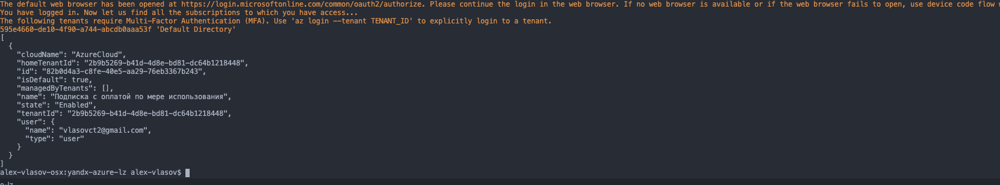

# Setting up a VPN between Azure VNET and Yandex VPC

## Overview and target scenario
If you need to deploy a Site-to-Site VPN connection between Yandex.Cloud and Microsoft Azure, you can use this example and module to set it up.

## Prerequisites

The list of prerequisites required to configure VPN Scenario: 
- [Azure CLI](https://docs.microsoft.com/en-us/cli/azure/install-azure-cli)
- [YC CLI](https://cloud.yandex.com/en-ru/docs/cli/operations/install-cli)
- [Terraform client](https://learn.hashicorp.com/tutorials/terraform/install-cli)

## Yandex СLI Installation
To automate Yandex.Cloud credentials provisioning (iam-token) install YC-CLI using the following guide [YC CLI](https://cloud.yandex.com/docs/cli/quickstart)


## Authorize Yandex Cloud Credentials for Provider:
```bash
export YC_TOKEN=$(yc iam create-token)
export YC_CLOUD_ID=$(yc config get cloud-id)
export YC_FOLDER_ID=$(yc config get folder-id)
```

## Azure authentication

It is recommended to create a Service Principal which will be used for authentication purposes in Azure.
The process of creating a Service Principal includes the following steps:

1. Login to Azure CLI:
```
az login
```
2. List the subscriptions associated with the account:
```
az account list
```
3. Specify the subscription to use (if more than one available):
```
az account set --subscription="SUBSCRIPTION_ID"
```
4. Create the Service Principal which will be used to manage the resources:
```
az ad sp create-for-rbac --role="Contributor" --scopes="/subscriptions/SUBSCRIPTION_ID"
```
5. The command above will output five values which will be used in this guide for deployment:
```
{
  "appId": "00000000-0000-0000-0000-000000000000",
  "displayName": "azure-cli-2021-00-00-00-00-00",
  "name": "http://azure-cli-2021-00-00-00-00-00",
  "password": "0000-0000-0000-0000-000000000000",
  "tenant": "00000000-0000-0000-0000-000000000000"
}
```


<br/>

## What this module will deploy:
- **00-psk.tf** - this will generate random string to use as pre-shared key for VPN, and encrypt it as cipher-text string with Yandex.KMS.

- **01-azure-network.tf** - this component deploys *GatewaySubnet* and *protected-vpn-subnet* inside the specified azure vnet, creates necessary ip addreses 
- **01-yandex-network.tf** - creates subnet in specified yandex vpc, and deployes route table with static route towards *protected-vpn-subnet* on Azure as well as deploys necessary security groups for connectivity to work.
- **02-azure-vpn-gateway.tf** - creates and setups virtual gateway and vpn connection to local gateway (*yandex vpn vm*)
- **02-yandex-vpn.tf** - creates ipsec-instance machine in Yandex side, renders it's config with specified variables, for consistency reasons there must be sleep resource after the provisioning of azure connection, before yandex vpn template starts rendering, because Azure only creates ip address some time after attaching it to gateway


#### Example of usage
```HCL
module "azure-yandex-vpn" {
source = "../modules/vpn"
location = "westeurope"
rgname = "my_azure_rg"
yandex_vpc_id = "enpki4ukxxxxxxxxxxx"
azure_vnet_name = "vpn_test_vnet"
public_key_path = "~/.ssh/id_rsa.pub"
zone = "ru-central1-a"
yandex_subnet_range = "192.168.0.0/24"
azure_subnet_range = ["10.151.0.0/24"]
azure_gateway_subnet_range = ["10.0.255.0/24"]
```

## Deploying the playbook
#### Call in the terraform
```bash
terraform init
terraform plan
terraform apply
```

## Validation of playbook
Create Virtual Machine in protected VPN subnet and use ping to test conntectivity

## Remove created resources after they are not needed anymore
```bash
terraform destroy
```


